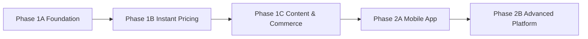

# 00 — Project Overview

## Source

- `3d-print-marketplace-SRS-firebase-portable-v1.md`: Sections 1–2, 5–17, 23–24, 32–35
- Initial files prompt: `00_create_init_ai_file(2).md`

## Project name

**3D Print Marketplace Thailand**

## Repository identity

| Item | Value |
|---|---|
| Product name | `3D Print Marketplace Thailand` |
| Repository slug | `pim-3d-hub` |
| Workspace package scope | `@pim/*` |

## Vision

สร้างศูนย์กลางด้าน 3D Printing ของประเทศไทยที่ทำให้ผู้ซื้อสามารถเปลี่ยนไอเดีย รูปภาพ แบบร่าง หรือไฟล์ 3D ให้เป็นชิ้นงานจริงได้ง่าย ขณะเดียวกันช่วยให้นักออกแบบ เจ้าของเครื่อง ร้านพิมพ์ และ Print Farm สร้างรายได้จากความเชี่ยวชาญและกำลังการผลิตที่มีอยู่

## One-line value proposition

> มีไฟล์ก็รู้ราคาและสั่งพิมพ์ได้ทันที ไม่มีไฟล์ก็หานักออกแบบได้ ติดตามงาน ดูผลงานจริง และซื้อขายเครื่องพิมพ์ได้ในแพลตฟอร์มเดียว

## Problem statement

### Buyer problems

- ประเมินราคาและวัสดุเองไม่ได้
- ต้องติดต่อหลายร้าน
- ไม่มีไฟล์ 3D หรือไฟล์ยังไม่พร้อมพิมพ์
- ขาดระบบติดตามและหลักฐานการผลิต
- กังวลคุณภาพ การชำระเงิน และความลับของไฟล์

### Provider problems

- เครื่องว่างและหาลูกค้าได้ยาก
- ต้องประเมินราคาด้วยมือซ้ำ ๆ
- ไม่มีระบบคิวงาน ใบเสนอราคา Payment และ Shipping ครบวงจร
- ไม่มีพื้นที่ Showcase ที่เชื่อมกับคำสั่งซื้อจริง

### Product seller problems

- Marketplace ทั่วไปไม่มี schema เฉพาะเครื่องพิมพ์
- เครื่องมือสองไม่มี checklist หรือหลักฐานทดสอบมาตรฐาน
- ผู้ซื้อเปรียบเทียบสเปกและรีวิวจากผู้ใช้จริงได้ยาก

## Product goals

1. เปิดใช้งาน Mobile-first Web App/PWA ก่อน
2. รองรับบริการ 3 แบบอย่างชัดเจน
3. สร้าง Instant Quote เมื่อไฟล์และเครื่องเข้าเงื่อนไข
4. Fallback เป็น Manual Quote โดยไม่สูญเสียข้อมูล
5. ทำให้ Order, Payment, Production และ Shipping ตรวจสอบย้อนหลังได้
6. สร้าง Verified Review และ Content Commerce
7. สร้างตลาดเครื่องพิมพ์และอุปกรณ์เฉพาะทาง
8. ใช้ Firebase ใน Phase 1 โดยลด Vendor Lock-in
9. ใช้ Backend/API เดียวกันกับ Mobile App Phase 2
10. เตรียม Portable Export และ Migration ไป PostgreSQL/MongoDB

## Non-goals

- Remote control เครื่องพิมพ์ใน Phase 1
- Live Streaming ใน Phase 1
- สร้าง e-wallet หรือถือเงินเองโดยไม่มี licensed payment partner
- รองรับทุกกระบวนการผลิตอุตสาหกรรมตั้งแต่วันแรก
- Logistics fleet ของแพลตฟอร์มเอง
- ตลาดต่างประเทศใน MVP
- AI-generated design หรือ automatic file repair ขั้นสูงใน MVP

## Target personas

| Persona | Need | Primary success |
|---|---|---|
| Buyer มือใหม่ | ส่งรูปหรือไอเดียและได้รับคำแนะนำ | สร้างงานและเลือกราคาได้ |
| Buyer มีไฟล์ | ราคาเร็วและร้านที่รองรับจริง | Instant Quote/Order สำเร็จ |
| Designer | รับงานออกแบบและส่งมอบเป็นงวด | Milestone และ revision ชัดเจน |
| Print Provider | ใช้เครื่องว่างสร้างรายได้ | มีงานตรง capability |
| Full-service Provider | ดูแลงานครบวงจร | Workflow เดียวตั้งแต่แบบถึงส่ง |
| Product Seller | ขายเครื่องและวัสดุ | Listing มีข้อมูลเฉพาะทาง |
| Creator | สร้างคอนเทนต์และเชื่อมยอดขาย | Content-to-order conversion |
| Admin | ควบคุมความเสี่ยงและข้อพิพาท | ตรวจสอบและ audit ได้ |

## Roles and permissions summary

| Role | Main permissions |
|---|---|
| `BUYER` | ลงงาน ขอราคา สั่งซื้อ ชำระเงิน รีวิว เปิดข้อพิพาท |
| `DESIGN_PROVIDER` | ลงบริการดีไซน์ เสนอราคา ส่งแบบและ milestone |
| `PRINT_PROVIDER` | เพิ่มเครื่อง/วัสดุ รับงานพิมพ์ อัปเดตการผลิต |
| `FULL_SERVICE_PROVIDER` | สิทธิของ designer + print provider |
| `PRODUCT_SELLER` | ลงสินค้า จัดการ stock/order และ promotion |
| `CONTENT_CREATOR` | สร้างโพสต์ สื่อ comment และ affiliate เมื่อเปิดใช้ |
| `SUPPORT_AGENT` | ดูข้อมูลสนับสนุนที่จำเป็นและตอบเคส |
| `KYC_REVIEWER` | ตรวจ verification case |
| `FINANCE_ADMIN` | payment/refund/payout operations |
| `MODERATOR` | content/product/report moderation |
| `PLATFORM_ADMIN` | configuration, access และ operations ระดับสูง |

## Core modules

1. Identity, Accounts, Organizations และ KYC
2. Provider Profile, Services, Printers, Materials และ Capacity
3. File Assets, Upload Session และ Model Analysis
4. Service Requests, Proposals และ Milestones
5. Instant Pricing และ Quote Snapshot
6. Orders, State Machine และ Production Updates
7. Payment, Refund และ Payout
8. Shipping และ Proof of Delivery
9. Messaging และ Notifications
10. Reviews, Disputes และ Trust
11. Content, Community และ Promotion
12. Product Marketplace
13. Search และ Discovery
14. Admin, Moderation, Audit และ Feature Flags
15. Export, Migration และ Data Portability

## MVP scope

### Phase 1A — Marketplace Foundation

- Account, roles, profile, KYC baseline
- Provider services, printers, materials
- Service Request และ Proposal
- Conversation/chat
- Service Order, payment, shipping
- Production updates, verified review
- Admin baseline

### Phase 1B — Instant Pricing

- Upload Session
- 3D Viewer
- Model Analysis
- Pricing Profile
- Machine Matching
- Eligibility Engine
- Instant Quote, Price Lock และ Capacity

### Phase 1C — Content and Commerce

- Post/feed/showcase
- Follow, reaction, comment, save
- Sponsored content/shop/product
- Product marketplace และ used-printer checklist
- Subscription/plan baseline

## Out of scope for initial release

- Mobile native application
- Cloud slicing สำหรับทุก printer profile
- Dynamic pricing จาก demand แบบ realtime
- IoT printer monitoring
- Affiliate settlement เต็มรูปแบบ
- Credit term/financing
- Cross-border commerce
- Industrial certification workflow

## Roadmap

## Foundation implementation baseline

| Area | Baseline | Status |
|---|---|---|
| Web/PWA | `Next.js` App Router + TypeScript/React | Accepted for Phase 1 |
| Package manager/monorepo | `pnpm` workspaces + `turbo` | Accepted |
| API contract | `zod` boundary schemas + OpenAPI 3.1 artifact + generated typed clients | Accepted |
| OpenAPI governance | `@redocly/cli` lint/bundle + breaking-change checks | Accepted |
| Test stack | `vitest` + `@playwright/test` | Accepted |
| Async workers | Transactional Outbox + `QueuePort` + Google Cloud Tasks HTTP dispatch | Accepted for Phase 1 |
| Search | Firestore-backed projection/read models behind `SearchPort` | Accepted for Phase 1 |
| Realtime UX | REST source of truth + polling baseline + SSE where needed | Accepted for Phase 1 |
| Payment/payout | `PaymentGatewayPort`; partner/vendor still open | Open vendor decision |
| KYC/shipping | Manual-first baseline behind `KycPort` and `ShippingPort`; vendors still open | Accepted baseline |
| Model parsing/analysis | Scope limited to `STL`, `OBJ`, `3MF`; exact libraries still open | Open library decision |
| Mobile app | Flutter vs React Native | Open until Task 59 |

## Success metrics

### Marketplace liquidity

- เวลาจนได้รับ proposal แรก
- จำนวน proposal ที่มีคุณสมบัติต่องาน
- Provider active rate
- Job-to-hire conversion

### Quote and order conversion

- Upload-to-quote
- Instant quote eligibility rate
- Instant quote-to-checkout
- Manual quote-to-order
- Repeat purchase rate

### Quality

- On-time delivery
- Cancellation rate
- Reprint/refund/dispute rate
- Verified review score
- Provider response time

### Content and commerce

- Content creation rate
- Verified content ratio
- Content-to-store click
- Content-to-order conversion
- Product listing-to-sale conversion

### Reliability and portability

- Core API availability
- P95 latency
- Export success
- Repository contract pass rate
- PostgreSQL/MongoDB import rehearsal success

## Principal risks

| Risk | Impact | Mitigation |
|---|---|---|
| Auto price inaccurate | loss/dispute | eligibility gate, versioned profile, safety margin, manual fallback |
| Provider overbooks | delayed orders | capacity slots, reservation, timeout, auto-pause |
| File leakage | business/legal damage | private storage, signed access, audit, NDA workflow |
| Payment/payout complexity | regulatory/financial risk | provider abstraction, licensed partner, webhook idempotency |
| Fake review/content | trust loss | verified order badge, moderation, anti-spam |
| Firestore lock-in | future migration cost | canonical model, repositories, portable export, contract tests |
| Marketplace cold start | insufficient liquidity | seed providers, regional launch, assisted matching |
| Used printer fraud | customer harm | KYC, checklist, proof video, dispute and inspection option |

## Assumptions

- ผู้ใช้หลักอยู่ในประเทศไทย
- ภาษาเริ่มต้นไทย รองรับอังกฤษ
- THB และ millimeter เป็นค่าเริ่มต้น
- Asset ขนาดใหญ่เก็บใน Object Storage
- งานวิเคราะห์ไฟล์ทำผ่าน background job
- Payment/escrow-like flow ทำผ่าน partner ที่ได้รับอนุญาต
- Phase 1 เริ่มจาก FDM/Resin และ file formats ที่ทีม validate ได้
- ทีม foundation ใช้ `pnpm`, `turbo`, `Next.js`, `vitest` และ `@playwright/test` เป็น baseline เดียวกันทั้ง repo
- Search, KYC, shipping และ payment integration ต้องผ่าน port/adapter แม้รุ่นแรกจะเริ่มจาก manual-first workflow บางส่วน

## Open questions

1. Marketplace เปิดพร้อมกันทั่วประเทศหรือเริ่มบางจังหวัด?
2. เกณฑ์ KYC สำหรับ provider/product seller แต่ละระดับคืออะไร?
3. ใช้ payment partner และ payout model ใดหลังตรวจ legal/commercial constraints แล้ว?
4. เลือก mobile framework เป็น Flutter หรือ React Native หลัง spike ใน Task 59?
5. เลือก parser/viewer/analyzer library ใดสำหรับ `STL`/`OBJ`/`3MF` หลัง Task 45–46?
6. งานใดอนุญาต COD หรือไม่อนุญาตทั้งหมด?
7. Instant quote รองรับ printer/material combination ใดในรุ่นแรก?
8. Platform fee และ cancellation/refund policy เป็นเท่าใด?
9. ใช้ human moderation, automated moderation หรือ hybrid?
10. Product marketplace จะรองรับ cart หลายร้านใน MVP หรือ order ต่อร้าน?
11. ต้องมีใบกำกับภาษีกลางหรือให้ผู้ขายเป็นผู้ออก?
12. เกณฑ์ Quality Verified และ Official Store คืออะไร?
