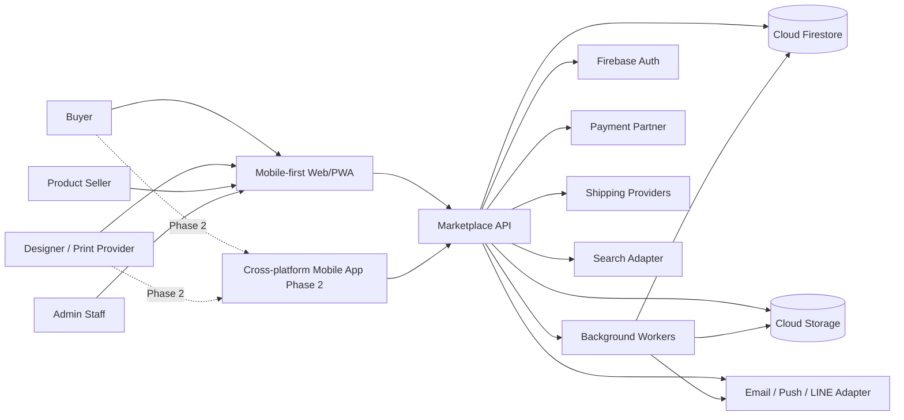
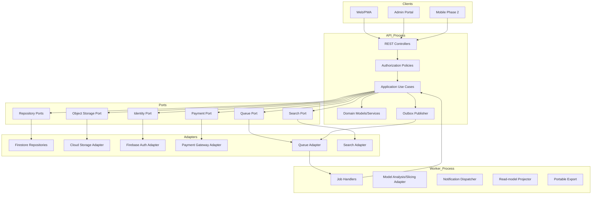
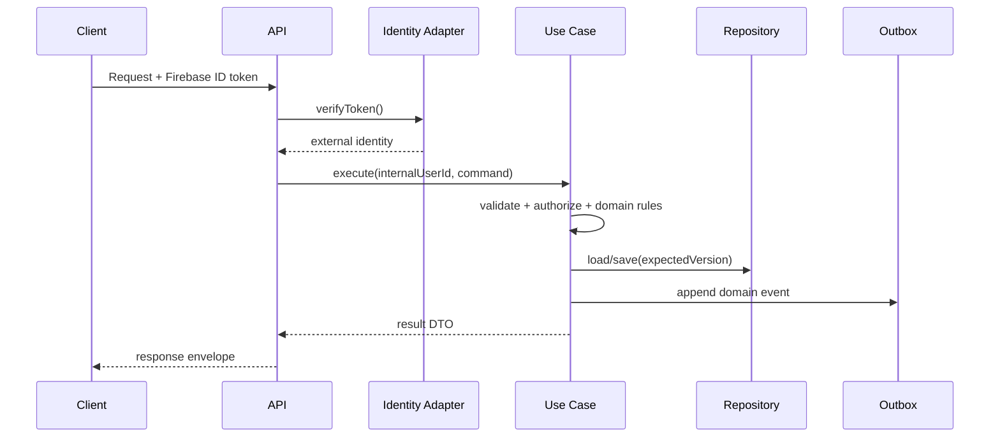
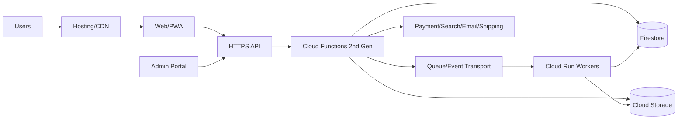

# 01 — Architecture

## Source

- `3d-print-marketplace-SRS-firebase-portable-v1.md`: Sections 3–4, 18–20, 22–31
- Related: [Database Design](03-database-design.md), [API Standard](04-api-standard.md), [Security Rules](07-security-rules.md)

## Architecture goals

- ส่งมอบ Phase 1 ได้เร็วด้วย Firebase managed services
- ป้องกัน Firebase types และ Firestore query model รั่วเข้าสู่ Domain
- ให้ Web, Admin และ Mobile ใช้ API Contract เดียวกัน
- รองรับงาน synchronous และ long-running file jobs
- รองรับ payment webhook และ idempotent transaction
- แยก business modules ชัดเจน แต่หลีกเลี่ยง microservices ก่อนจำเป็น
- Export และย้ายข้อมูลไป PostgreSQL/MongoDB ได้
- รองรับ audit, observability, recovery และ progressive scaling

## Architectural style

ใช้ **Modular Monolith + Clean/Hexagonal Architecture** ใน Phase 1

```text
Presentation -> Application -> Domain <- Ports <- Infrastructure Adapters
```

Dependency rule:

- Presentation พึ่ง Application Contracts
- Application พึ่ง Domain
- Domain ไม่พึ่ง framework/cloud/database
- Infrastructure implement ports และพึ่ง SDK ภายนอก
- Adapter ห้าม export SDK-specific types ไปชั้นบน

## System context



## Logical components



## Proposed repository topology

```text
apps/
  web/
  admin/
  mobile/
services/
  api/
  workers/
packages/
  domain/
  application/
  contracts/
  infrastructure/
  ui/
  config/
  testkit/
firebase/
infra/
tools/
docs/
```

## Module boundaries

| Module | Owns | Does not own |
|---|---|---|
| Identity | internal user, identity mapping, roles, org membership | Firebase UID as business ID |
| Provider | profiles, services, printers, materials, capacity | orders/payment |
| Files | upload, metadata, analysis, retention | pricing decision |
| Jobs | service request, proposal, proposal versions | payment |
| Pricing | eligibility, pricing profile, quote snapshot | order lifecycle |
| Orders | order aggregate, milestones, status machine | provider payout execution |
| Payments | intents, events, refunds, payouts | order business state rules |
| Shipping | shipment and tracking | payment |
| Messaging | conversations/messages | order source of truth |
| Trust | review, dispute, verification | content ranking |
| Content | posts/media/comments/reactions/follows | verified order truth |
| Commerce | products, variants, inventory, product orders | service orders |
| Promotion | campaign/placement/subscription | organic score manipulation |
| Admin | operations views and commands | bypassing domain policy |
| System | outbox, idempotency, audit, flags, export | user-facing business entities |

## Request flow

### Standard authenticated command



### File analysis flow

1. Client requests upload session.
2. API creates `file_asset` in `PENDING_UPLOAD`.
3. Client uploads directly to object storage via time-limited URL/session.
4. API verifies checksum and metadata.
5. API writes outbox event `file.uploaded`.
6. Worker performs malware scan and model analysis.
7. Worker writes versioned `model_analysis`.
8. Notification/read model updates.
9. Client polls or receives notification.
10. Pricing eligibility starts only after trusted analysis state.

### Payment flow

1. API creates internal `payment_intent`.
2. Payment Adapter creates provider-side intent/QR.
3. Client pays outside trusted application boundary.
4. Provider sends signed webhook.
5. Webhook verifies signature and idempotency.
6. Payment service updates payment and transitions order safely.
7. Notifications and payout scheduling are asynchronous.

## Frontend architecture

- Feature-based routing
- Generated API client from OpenAPI
- Firebase client SDK only in `identity/`, `app-check/`, `push/`
- No Firestore SDK import in business features
- PWA caches static shell and safe public reads only
- Offline drafts use schema version and expiry
- Sensitive data is not stored in analytics or service-worker caches

## Backend/API structure

```text
module/
  domain/
  application/
  infrastructure/
  presentation/
```

Composition root selects adapters by configuration:

```text
DATABASE_ADAPTER=firestore | postgres | mongodb
PAYMENT_ADAPTER=...
SEARCH_ADAPTER=...
```

## Data storage

### Operational data

Phase 1: Firestore top-level collections with canonical UUID document IDs.

### Binary data

Object Storage with private-by-default bucket, quarantine, checksum, MIME/size metadata and short-lived access.

### Search

Use `SearchPort`; options:

1. Firestore query + curated read models
2. Managed search engine
3. PostgreSQL FTS/PostGIS after migration

## Authentication and session model

- Client authenticates with Firebase Auth
- Backend verifies token
- External identity maps to internal UUID
- Authorization uses internal ID and permissions
- High-risk operations may require recent login/MFA
- Suspended internal account overrides valid identity token

## Background jobs and events

Use Transactional Outbox:

- aggregate + outbox saved atomically
- dispatcher publishes to queue
- consumer idempotent
- retry with backoff
- dead-letter and replay with audit

Example events:

- `file.uploaded`
- `file.analysis.completed`
- `proposal.accepted`
- `order.created`
- `order.status_changed`
- `payment.succeeded`
- `shipment.dispatched`
- `review.created`
- `post.published`
- `promotion.activated`

## Cache/CDN

- CDN for public static assets and public post media
- no public CDN for private model/KYC/order assets
- safe API caching only for public read models
- no cache for payment, authorization or mutable private data

## Observability

Every request/job carries requestId, traceId, module, action, adapter/provider, duration and safe outcome code.

Required signals:

- structured logs
- API latency/error metrics
- queue depth/age
- analysis failures
- webhook failures
- order conflicts
- export/backup status
- security events

## Deployment topology



## Scalability considerations

- Stateless API
- Cursor pagination
- No unbounded arrays
- Avoid hot documents
- Async counters/read models
- Queue heavy work
- Expiring capacity reservations
- Optimistic concurrency
- Per-user/IP/resource rate limits
- Split services only when justified by scale/team ownership

## Portability controls

- UUIDv7 canonical IDs
- UTC RFC3339 API timestamps
- integer minor units
- lat/lng numbers
- references as string IDs
- top-level collections
- schema/entity versions
- no Firestore cursors exposed
- JSONL + manifest + checksums
- adapter contract tests
- dual-write/shadow-read migration plan

## Key tradeoffs

| Decision | Benefit | Cost |
|---|---|---|
| Modular monolith | faster delivery, simpler transactions | needs strict module discipline |
| Firestore first | managed scale, fast startup | query/index constraints |
| API-only business data | portability/security | more backend work |
| Top-level collections | portable relationships | explicit indexes |
| Outbox/events | reliable side effects | operational complexity |
| Read models | fast search/feed | eventual consistency |
| UUIDv7 | portable/time-sortable | app-side generation |
| Cloud Run for slicer | native/container support | job orchestration |

## Open technical decisions

- Web framework/package manager/monorepo tooling
- Mobile framework
- Queue/event transport
- Search implementation
- Payment/payout partner
- KYC provider
- Shipping APIs
- Malware scanning
- Model parser/slicer
- Observability vendor
- Infrastructure-as-code tool
