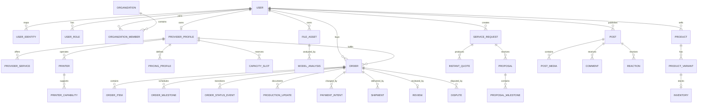

# 03 — Database Design

## Source

- `3d-print-marketplace-SRS-firebase-portable-v1.md`: Sections 3, 18–19, 27–29, 31
- Related: [Architecture](01-architecture.md), [Security Rules](07-security-rules.md)

## Objectives

- Canonical model ไม่ขึ้นกับ Firestore/PostgreSQL/MongoDB
- Firestore เป็น Phase 1 adapter
- ความสัมพันธ์จำนวนมากเป็น entity แยก
- รองรับ optimistic concurrency, audit, soft delete
- รองรับ portable export/import
- read model rebuild ได้
- financial/order snapshots immutable

## Canonical base fields

| Field | Type | Required | Notes |
|---|---|---:|---|
| `id` | UUIDv7 string | yes | canonical business ID |
| `schemaVersion` | integer | yes | stored schema |
| `version` | integer | yes | optimistic concurrency |
| `createdAt` | timestamp | yes | UTC |
| `updatedAt` | timestamp | yes | UTC |
| `deletedAt` | timestamp/null | yes | null when active |
| `createdBy` | UUID/null | contextual | actor |
| `updatedBy` | UUID/null | contextual | actor/system |

Portability rules:

- API timestamp: RFC3339
- PostgreSQL: `timestamptz`
- MongoDB: BSON Date
- Money: integer minor units + currency
- Location: numeric latitude/longitude
- Reference: string ID
- Binary: object storage only
- Flexible metadata: versioned and allowlisted

## Domain ERD



## Entity catalog

### Identity

| Entity | Key fields |
|---|---|
| `users` | displayName, locale, status, profileImageAssetId |
| `user_identities` | userId, provider, providerSubject, emailNormalized |
| `user_roles` | userId, roleCode, scopeType, scopeId, status |
| `organizations` | name, type, status |
| `organization_members` | organizationId, userId, roleCode, status |
| `addresses` | ownerType, ownerId, label, address, lat/lng |
| `verification_cases` | subjectType, subjectId, type, status, reviewerId |

Constraints:

- `(provider, providerSubject)` unique
- active role scope unique
- organization membership unique

### Provider

| Entity | Key fields |
|---|---|
| `provider_profiles` | owner, publicName, province, rating summary, status |
| `provider_services` | providerId, serviceType, instantOrderEnabled, leadTime |
| `printers` | providerId, brand/model code, technology, buildVolumeMm, quantity |
| `printer_capabilities` | printerId, material, layer/resolution/nozzle range |
| `materials` | canonical material catalog |
| `provider_materials` | providerId, material, color, stockStatus |
| `pricing_profiles` | provider/scope, versionNo, formula inputs, status |
| `capacity_slots` | provider/printer, period, total/reserved units |

Service type:

- `DESIGN_ONLY`
- `PRINT_ONLY`
- `DESIGN_AND_PRINT`

### File

| Entity | Key fields |
|---|---|
| `file_assets` | owner, purpose, originalName, MIME, size, checksum, storageKey, visibility, status |
| `model_analyses` | fileAssetId, analyzerVersion, units, boundsMm, volume, meshHealth, eligibilityHints |

File status:

- `PENDING_UPLOAD`
- `UPLOADED`
- `QUARANTINED`
- `SCANNING`
- `READY`
- `REJECTED`
- `DELETED`

### Jobs and pricing

| Entity | Key fields |
|---|---|
| `service_requests` | buyerId, serviceType, requirements, budget, dueAt, visibility, status |
| `proposals` | requestId, providerId, revisionNo, totals, validity, status |
| `proposal_milestones` | proposalId, sequence, title, amount, deliverable |
| `instant_quotes` | buyer/provider, profile/analysis versions, snapshots, totals, expiry |

Invariants:

- proposal revision history preserved
- accepted revision immutable
- quote records exact rule/profile/analysis versions
- expired quote cannot create order
- capacity reservation expires and is idempotent

### Orders

| Entity | Key fields |
|---|---|
| `orders` | orderNumber, type, buyer/provider, source, status, totals, snapshots |
| `order_items` | orderId, itemType, description, quantity, totals |
| `order_participants` | orderId, userId, role, permissions |
| `order_milestones` | orderId, sequence, status, amount, dueAt |
| `order_status_events` | orderId, from/to, actor, reason |
| `production_updates` | orderId, type, message, assetIds |
| `change_requests` | orderId, changes, price/schedule delta, status |

Service order status baseline:

- `DRAFT`
- `AWAITING_PROVIDER_CONFIRMATION`
- `AWAITING_PAYMENT`
- `PAID`
- `PREPARING`
- `IN_PRODUCTION`
- `POST_PROCESSING`
- `QUALITY_CHECK`
- `READY_TO_SHIP`
- `SHIPPED`
- `DELIVERED`
- `COMPLETED`
- `CANCELLED`
- `DISPUTED`

### Financial

| Entity | Key fields |
|---|---|
| `payment_intents` | orderId, providerCode, externalId, amount, status |
| `payment_events` | intentId, providerEventId, type, verified |
| `refunds` | order/payment, amount, reason, status |
| `payouts` | payee, orderIds, gross/net/fee, status |

- provider event ID unique
- financial records never hard delete
- sensitive raw payload restricted
- totals reconciled

### Messaging, shipping, trust

| Entity | Purpose |
|---|---|
| `conversations` / `conversation_members` / `messages` | contextual messaging |
| `shipments` / `shipment_events` | delivery and tracking |
| `reviews` | verified order review |
| `disputes` / `dispute_events` | dispute workflow |
| `reports` / `moderation_cases` | reporting/moderation |

### Content, commerce, promotion

| Entity | Purpose |
|---|---|
| `posts`, `post_media`, `comments`, `reactions`, `follows`, `saved_items` | community |
| `products`, `product_variants`, `inventories` | marketplace |
| `promotion_campaigns`, `promotion_placements` | paid visibility |
| `subscriptions` | plans/entitlements |

### System

| Entity | Purpose |
|---|---|
| `outbox_events` | reliable async |
| `idempotency_records` | duplicate prevention |
| `audit_logs` | append-only security/operation history |
| `feature_flags` | rollout control |
| `export_runs` | export status/manifest |

## Firestore physical model

Top-level collections; document ID equals canonical ID:

```text
/users/{id}
/user_identities/{id}
/provider_profiles/{id}
/provider_services/{id}
/printers/{id}
/file_assets/{id}
/model_analyses/{id}
/service_requests/{id}
/proposals/{id}
/instant_quotes/{id}
/orders/{id}
/order_status_events/{id}
/messages/{id}
/posts/{id}
/products/{id}
/outbox_events/{id}
```

ห้ามใช้ nested lifecycle-critical model เช่น `/users/{id}/orders/{id}/messages/{id}`

## Representative schemas

### Pricing profile

```json
{
  "id": "uuid",
  "providerId": "uuid",
  "scope": {
    "serviceId": "uuid",
    "printerId": "uuid",
    "materialCode": "PLA"
  },
  "versionNo": 3,
  "currency": "THB",
  "minimumOrderMinor": 15000,
  "materialRateMinorPerGram": 350,
  "machineRateMinorPerMinute": 40,
  "setupFeeMinor": 5000,
  "supportMultiplierBps": 1200,
  "riskBufferBps": 800,
  "rushMultiplierBps": 15000,
  "status": "ACTIVE",
  "effectiveFrom": "2026-07-01T00:00:00Z",
  "schemaVersion": 1,
  "version": 1,
  "createdAt": "2026-06-27T00:00:00Z",
  "updatedAt": "2026-06-27T00:00:00Z",
  "deletedAt": null
}
```

### Instant quote

```json
{
  "id": "uuid",
  "buyerId": "uuid",
  "providerId": "uuid",
  "fileAssetId": "uuid",
  "modelAnalysisId": "uuid",
  "pricingProfileId": "uuid",
  "pricingProfileVersion": 3,
  "currency": "THB",
  "inputSnapshot": {
    "quantity": 2,
    "materialCode": "PLA",
    "colorCode": "BLACK",
    "qualityCode": "STANDARD"
  },
  "lineItems": [
    {"code": "MATERIAL", "amountMinor": 24000},
    {"code": "MACHINE", "amountMinor": 18000},
    {"code": "SETUP", "amountMinor": 5000}
  ],
  "subtotalMinor": 47000,
  "platformFeeMinor": 3500,
  "shippingMinor": 5000,
  "totalMinor": 55500,
  "status": "ACTIVE",
  "expiresAt": "2026-06-27T12:00:00Z",
  "schemaVersion": 1,
  "version": 1,
  "createdAt": "2026-06-27T10:00:00Z",
  "updatedAt": "2026-06-27T10:00:00Z",
  "deletedAt": null
}
```

## Index plan

- `service_requests(status, serviceType, provinceCode, createdAt desc)`
- `proposals(serviceRequestId, status, createdAt desc)`
- `orders(buyerId, status, updatedAt desc)`
- `orders(providerId, status, updatedAt desc)`
- `provider_services(serviceType, provinceCode, instantOrderEnabled, rating desc)`
- `printers(providerId, technologyCode, status)`
- `capacity_slots(providerId, startsAt, status)`
- `file_assets(ownerId, status, createdAt desc)`
- `posts(status, visibility, publishedAt desc)`
- `products(categoryCode, status, createdAt desc)`
- `messages(conversationId, createdAt asc)`
- `notifications(userId, readAt, createdAt desc)`

ทุก index ต้องผูกกับ documented query.

## Constraints and concurrency

Firestore uniqueness ใช้ transactional check/reservation document; PostgreSQL ใช้ unique/FK/check; MongoDB ใช้ unique index/schema validation

ทุก adapter ต้องรองรับ:

- expected version
- idempotency
- reservation race
- soft delete
- stable pagination

## Read models

Allowed:

- provider search card
- quote comparison
- order summary
- feed card
- product search card

Rules:

- `projectionVersion`
- rebuildable
- not source of truth for finance/permission
- eventual consistency visible where relevant

## Retention

| Data | Initial direction |
|---|---|
| Financial/audit | retain per legal/accounting; no hard delete |
| Private models | configurable after order closure |
| Rejected/quarantined files | short retention |
| Chat/evidence | through dispute/legal window |
| KYC | minimum necessary |
| Public posts | soft delete + moderation history |
| Idempotency/outbox | beyond retry/replay window |

Exact periods are open decisions.

## Backup/export

- provider-native backup
- JSONL export + manifest/checksum
- asset manifest
- restore rehearsal
- entity count and reference report
- RPO/RTO runbook

## Portable export layout

```text
export/
  manifest.json
  entities/*.jsonl
  assets/manifest.jsonl
  integrity/counts.json
  integrity/references.json
  integrity/checksums.json
```

## PostgreSQL mapping

- entity -> table
- `id` -> uuid
- timestamp -> timestamptz
- money -> bigint
- metadata -> jsonb
- relation -> FK where appropriate
- optional PostGIS
- outbox table
- stable `(sortField, id)` cursor

## MongoDB mapping

- entity -> collection
- canonical UUID string/standard BSON UUID
- references remain IDs
- timestamp Date
- money integer
- indexes mirror use cases
- avoid unbounded embedding
- limited aggregate transactions

## Privacy

- separate KYC/private/public data
- access logs
- consent/purpose
- export/delete workflow
- legal retention exceptions
- private object storage
- no public model files by default

## Open questions

- Exact KYC schema/retention
- Shared service/product order aggregate or separate aggregates
- Search read-model storage
- Tax document schema
- Address normalization
- Exact order transition matrix
- Exact pricing formula/rounding
